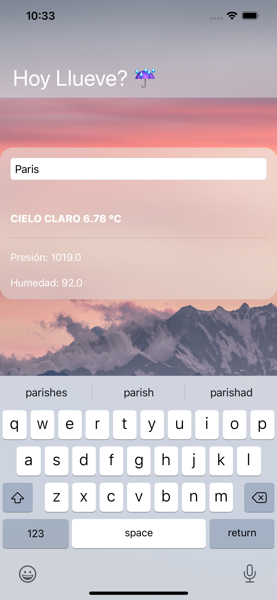
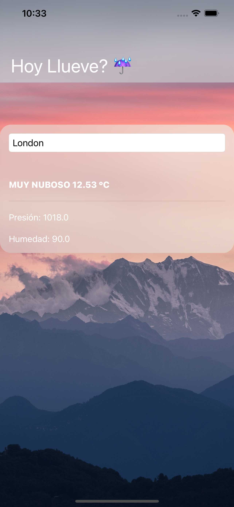

# swiftui-weatherApp

App that makes use of OpenWatherMap API

Before running make sure you get your own API code: https://openweathermap.org/api and replace it in WeatherService.apiKey :)

Screenshots: 

  
  

